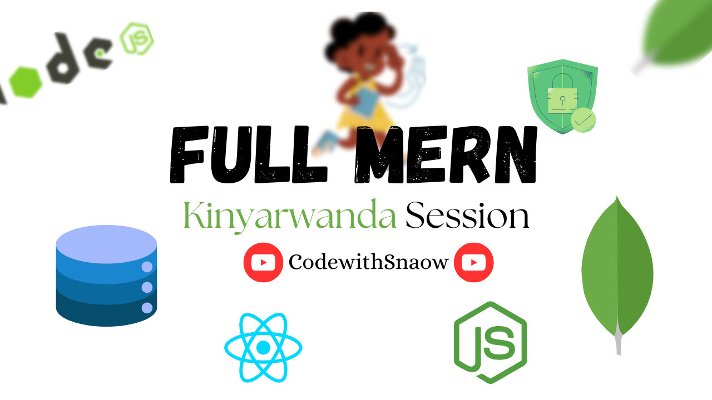

#Building Complete MERN app Course



- *instructor:*     Nkiko Hertier
- *Duration:*       01:23:03 (1h)
- *audience:*       Intermediate Developers
- *Available as:*   [Youte Video](https://youtu.be/1qyaLmXr4BI)

## Description

MERN App built with React front-end, MongoDB as database + Express for building APIs.

## Instructions

### Front End

first install all dependencies with command: `npm i` then run the app using `npm run dev`

### Back-End

1. Install all required dependencies with `npm i && npm i nodemon`
2. Navigate to [ConnectDb.js](./database/ConnectDb.js)

replace `<your-mongodb-connection-string>` with your connection String

```js
...
await mongoose.connect("<your-mongodb-connection-string>");
...

```

3. Run your backend server using `node index.js` or `nodemon index.js` (if installed)


# CATION:

- The codes are learning purpose with only Products done meaning StockIn and Out Modules can be done as homework.